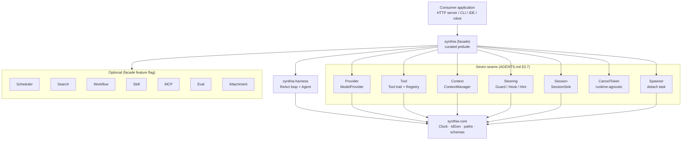

# Architecture — Synthia

> 本文是顶层架构总览，给第一次接触仓库的读者 30 分钟级别理解。深度细节
> 见 [`SEAMS.md`](../SEAMS.md)（7 大组件的可替换点清单）与各 crate 自身
> 的 `README.md`。

## 一、设计原则

| 原则 | 工程上的体现 |
|---|---|
| **可作为 lib** | `cargo add synthia` 是消费端唯一入口；25 个底层 crate 永远是单向依赖（`synthia` → `synthia-*` → `synthia-core`），`cargo tree -p synthia-core` 验证无环 |
| **乐高式组装** | 七大组件各自独立 trait + 默认实现；消费者可单点替换 `ModelProvider` / `Tool` / `ContextManager` / `Steering` / `SessionSink` / `CancelToken` / `Spawner` 中任意一项 |
| **运行时无关** | 除 `synthia-server`（可选）外，任何 crate 的公共 API 不出现 `tokio::*` / `async-std::*` / `smol::*`；`make check-public-api-runtime` 是这条线的门禁 |
| **时间 / ID 唯一入口** | 墙钟走 [`synthia_core::Clock`](https://docs.rs/synthia-core) trait；ID 走 [`synthia_core::IdGen`](https://docs.rs/synthia-core) trait；测试用 `SharedClock::fixed_at(t)` / `SharedIdGen::sequence()` 注入 |
| **依赖方向单向** | `synthia` → `synthia-*` → `synthia-core`，永远不回指；新 crate 必加同名 feature |

## 二、仓库布局

```
synthia/
├── Cargo.toml                # workspace + [workspace.dependencies] 单一来源
├── Makefile                  # 全栈命令入口（rust + web + docker）
├── AGENTS.md                 # 给所有 agent 的工程规范（人 + AI 都读）
├── CONTRIBUTING.md / SECURITY.md / RELEASE.md / MAINTAINERS.md
├── MINIMAL.md                # 4 步 MVP guide
├── SEAMS.md                  # 7 大组件的可替换点
├── rust-toolchain.toml       # 钉死 stable toolchain
├── rustfmt.toml / clippy.toml / deny.toml
│
├── crates/                   # 25 个 crate（含 facade）
│   ├── synthia               # facade: 单一入口 + curated `prelude`
│   ├── synthia-core          # Clock / IdGen / CancelToken / Spawner / Registry
│   ├── synthia-telemetry     # tracing + 可选 metrics / otlp
│   ├── synthia-provider      # ModelProvider + Anthropic / OpenAI adapters
│   ├── synthia-context       # ContextManager + 3 层 Memory
│   ├── synthia-tool          # 范式: Tool / ToolRegistry / exposure projection
│   ├── synthia-tool-{read,write,shell,todo,web,task,scheduler,search}  # 8 个插件
│   ├── synthia-skill         # skill 注册表 / 加载器
│   ├── synthia-session       # session 生命周期
│   ├── synthia-steering      # guard / hook / hint / tracker / output
│   ├── synthia-harness       # ReAct 循环 + Agent + ToolInterceptor
│   ├── synthia-server        # axum HTTP / SSE（应用 crate，**唯一**用 tokio）
│   ├── synthia-scheduler     # cron / interval / once dispatcher
│   ├── synthia-workflow      # 声明式工作流
│   ├── synthia-mcp           # MCP 客户端
│   ├── synthia-attachment    # 多模态附件
│   ├── synthia-eval          # 评测框架
│   ├── synthia-macros        # #[derive(Tool)] proc-macro
│   └── synthia-test-support  # 跨 crate mock 工具
│
├── synthia-web/              # React / Vite 前端（独立的 npm 项目）
├── contract-closure/         # 双侧契约闭环扫描（router ↔ fetch）
├── docs/                     # 架构 / spec / 设计文档
│   ├── ARCHITECTURE.md       # 本文件
│   ├── ROADMAP.md            # 公开路线图
│   ├── DEVELOPING.md         # 开发者深入指南
│   ├── superpowers/specs/    # 设计 spec（按 R 编号）
│   └── optimization-report-R*.md
│
├── .github/
│   ├── workflows/            # 6 个 workflow: ci / release / security-audit / docs / labeler / rust-quality
│   ├── ISSUE_TEMPLATE/       # bug / feature / question
│   ├── CODEOWNERS
│   ├── dependabot.yml
│   └── PULL_REQUEST_TEMPLATE.md
│
├── scripts/                  # shell 棘轮脚本（check-public-api-runtime 等）
└── dist/                     # release 产物 + sha256sums.txt
```

## 三、组件关系图



## 四、关键数据流

**单次 ReAct turn**（`synthia-harness/src/agent/re_act.rs`）：

```
provider.stream(prompt, history)
   │
   ▼
StopReason::ToolUse ──► ToolRegistry::call(name, args)
   │                        │
   │                        ▼
   │                  Tool::execute(ctx, args)
   │                        │
   │                        ▼
   │                  ToolResult → ContextManager::append_event
   │
   ▼
loop until StopReason::Done | Error | Cancel
```

**多智能体委派**（`synthia-tool-task`）走 `ToolInterceptor` seam，
re-entrant 调起子 harness；`synthia-workflow` 提供声明式 DAG 路径。

**事件流**：每个 turn 出一个 `AgentEvent`，经 `Steering::Hook` 与
`telemetry::Span` 双订阅；不阻塞主循环（默认 `futures::channel::mpsc`）。

## 五、可替换点（详细见 `SEAMS.md`）

| Seam | Trait | 默认实现 |
|---|---|---|
| Model | `ModelProvider` | `AnthropicProvider` / `OpenAICompatibleProvider` |
| Tool | `Tool` | 8 个离线 plugin crate（`-read` `-write` `-shell` `-todo` `-web` `-task` `-scheduler` `-search`） |
| Context window | `ContextManager` | `TruncatingContextManager` / `SummarizingContextManager` / `DagContextManager` |
| Policy | `Steering` | `Steering::default_policy(root)` / `tier::auto()` |
| Session | `SessionSink` | `MemorySink` / 文件 / 自建 |
| Cancel | `CancelToken` | `AtomicCancelToken`（std-only） |
| Spawn | `Spawner` | `TokioSpawner`（默认）/ std-thread 实现 |

## 六、CI/CD 流水线（详见 `.github/workflows/`）

| Workflow | 触发 | 做什么 |
|---|---|---|
| `ci.yml` | push/PR | fmt + clippy + test + examples + MSRV + 跨平台 build |
| `rust-quality.yml` | push/PR | `make ci` + 全 test + examples + web gates + bench |
| `release.yml` | tag `vX.Y.Z` | Linux / Windows / macOS 三平台产物 + `sha256sums.txt` + draft release |
| `security-audit.yml` | push/PR + 周一 cron | `cargo-audit` + `cargo-deny` + 密钥扫描 |
| `docs.yml` | push master | 全 workspace `cargo doc --all-features` 部署到 gh-pages |
| `labeler.yml` | push/PR | 按路径 / 标题给 PR 加标签 |
| `contract-closure.yml` | push/PR | 后端 router ↔ 前端 fetch 闭环扫描 |

## 七、为什么是这个形状

- **插件化先于框架对象**：`synthia` 不暴露一个 `SynthiaApp::builder()`
  这样的入口；消费者从 `synthia::module::…` 逐条 re-export 自由组合，
  不强制带任何 `use_ne_*`。
- **七 trait 一致抽象**：Provider / Tool / Context / Steering / Session /
  Cancel / Spawn 七件独立 trait，每件有 ≥ 1 个默认实现，方便"想换哪件换
  哪件"，与 pi-mono / LangChain 都不同（它们"框架对象"导致换件要绕
  全局对象）。
- **离线优先**：默认 `synthia = "0.1"` 零 HTTP / 零 DB / 零 reqwest
  （`make check-mvp-deps` 保证）。要 HTTP / DB 时显式 feature，污染面
  可控。

## 八、未来演进（详见 [`ROADMAP.md`](ROADMAP.md)）

- 1.0 路线：stable API 锁定 + `cargo publish` 上 crates.io；
- SLSA Build L2：OIDC-enabled token + `actions/attest-build-provenance@v2`；
- 多平台 binary：Linux aarch64 / RISC-V；
- 持续 plugin 中央化：把更多可选能力（`synthia-search` 的 provider
  feature、`synthia-tool-scheduler` 的 cron feature）抽到默认 feature
  集合外。

---

> 本文件由 `docs/ARCHITECTURE.md` 维护；改了顶层结构（新增 / 删减
> crate、改 seam、改 workflow 集合）必须同 PR 更新。