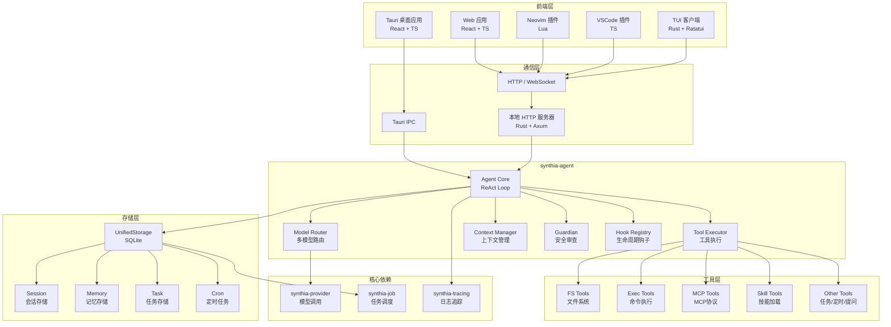

# Synthia Agent 技术架构文档

## 1. 概述与目标

Synthia Agent 是一个生产级 AI Agent 框架，使用 Rust 实现，支持多模型路由、工具执行、上下文管理和安全审查等企业级功能。

**核心特性**：
- **ReAct 推理循环**：基于 Reasoning and Acting 模式的智能体核心
- **多模型路由**：支持基于规则和自适应的模型选择策略
- **工具系统**：内置丰富的文件系统、命令执行、任务管理工具，支持 MCP 扩展
- **上下文管理**：三层压缩策略（Micro/Auto/Manual Compact）确保长会话正常运行
- **安全机制**：Guardian 模块提供分级安全审查
- **持久化存储**：SQLite-based 统一存储，支持会话、记忆、任务、定时任务

**支持的客户端**：
- **Tauri 桌面应用**（主要平台，基于 React + TypeScript）
- **Web 应用**（浏览器端，复用同一套前端代码）
- **Neovim 插件**（Lua）
- **VSCode 插件**（TypeScript）
- **TUI 客户端**（终端界面，Rust + Ratatui）

**核心设计原则**：
- **核心逻辑与前端解耦**：智能体核心封装为独立 Rust 库，供所有客户端复用
- **一套前端代码，多端适配**：通过适配器模式和环境变量，使 React 代码同时支持 Tauri 和 Web
- **本地服务统一接口**：通过本地 HTTP 服务器为编辑器插件和 TUI 提供统一的 REST API

---

## 2. 整体架构



**组件说明**：
- **synthia-agent**：Rust 核心库，实现 ReAct 推理循环、多模型路由、工具执行、上下文管理、安全审查等功能
- **synthia-provider**：模型 provider，支持多种 LLM 接入
- **synthia-job**：任务调度系统，支持 Cron 定时任务
- **UnifiedStorage**：基于 SQLite 的统一存储，支持会话、记忆、任务、定时任务持久化
- **Tauri 桌面应用**：包含 Rust 后端（直接调用 synthia-agent）和 React 前端（通过 IPC 与后端通信）
- **本地 HTTP 服务器**：由 Tauri 后端（或独立进程）启动，对外提供 REST API，供 Neovim/VSCode/TUI 调用

---

## 3. 核心模块设计

### 3.1 Agent Core (synthia-agent)

Agent 是整个框架的核心入口，采用组件组合模式：

```rust
#[derive(Clone)]
pub struct Agent {
    pub config: Arc<AgentConfig>,              // 配置管理
    pub tool_registry: Arc<ToolRegistry>,      // 工具注册表
    pub context_manager: Arc<dyn ContextManager>, // 上下文管理器
    pub session_manager: Arc<dyn SessionManager>, // 会话管理器
    pub model_router: Arc<dyn ModelRouter>,    // 模型路由器
    pub hook_registry: Arc<HookRegistry>,     // 生命周期钩子
    pub skill_tool: Arc<SkillTool>,           // 技能工具
    pub guardian: Arc<dyn Guardian>,           // 安全审查
    pub control: Arc<AgentControl>,            // 生命周期控制
}

impl Agent {
    pub fn new(
        config: Arc<AgentConfig>,
        tool_registry: Arc<ToolRegistry>,
        context_manager: Arc<dyn ContextManager>,
        session_manager: Arc<dyn SessionManager>,
        model_router: Arc<dyn ModelRouter>,
        hook_registry: Arc<HookRegistry>,
        skill_tool: Arc<SkillTool>,
        guardian: Arc<dyn Guardian>,
        control: Arc<AgentControl>,
    ) -> Self;
}
```

**ReAct 推理循环流程**：

```
    ┌──────────────┐
    │  User Input  │
    └──────┬───────┘
           ↓
    ┌──────────────┐
    │   Build      │ ← System Prompt + Context
    │   Prompt     │
    └──────┬───────┘
           ↓
    ┌──────────────┐
    │  Call LLM   │ ← Model Router 选择模型
    └──────┬───────┘
           ↓
    ┌──────────────┐
    │ stop_reason │
    │   ==        │──Yes──→ Return Response
    │ tool_use?   │
           │No
           ↓
    ┌──────────────┐
    │  Guardian    │ ← 安全审查
    │   Review     │
    └──────┬───────┘
           ↓
    ┌──────────────┐
    │  Execute     │
    │   Tools     │
    └──────┬───────┘
           ↓
    ┌──────────────┐
    │  Append      │
    │  Results     │
    └──────┬───────┘
           ↓
      ┌────┴────┐
      │ Loop    │
      └─────────┘
```

### 3.2 Model Router (多模型路由)

支持多种路由策略：

| 策略 | 说明 |
|------|------|
| Simple Router | 简单路由，基于配置 |
| Rule-Based Router | 基于规则的路由，根据任务类型选择模型 |
| Adaptive Router | 自适应路由，根据上下文动态选择 |

```rust
pub trait ModelRouter: Send + Sync {
    async fn route(&self, messages: &[Message]) -> Result<ModelResult>;
}
```

### 3.3 Context Manager (上下文管理)

三层压缩策略：

1. **Micro Compact**：每轮替换旧工具结果为占位符
2. **Auto Compact**：Token 超阈值时自动摘要
3. **Manual Compact**：手动触发压缩

```rust
pub trait ContextManager: Send + Sync {
    async fn build_context(&self, session_config: &SessionConfig) -> Result<Context>;
    async fn prune(&self, session_config: &SessionConfig) -> Result<()>;
    async fn compact(&self, session_config: &SessionConfig) -> Result<()>;
}
```

### 3.4 Guardian (安全审查)

三级安全机制：

| 级别 | 说明 |
|------|------|
| Auto Approve | 低风险操作自动通过 |
| Manual Approval | 中风险操作需要用户确认 |
| Reject | 高风险操作直接拒绝 |

```rust
pub trait Guardian: Send + Sync {
    async fn review(&self, request: &ApprovalRequest) -> Result<ApprovalResponse>;
}
```

### 3.5 Tool System (工具系统)

内置工具分类：

| 类别 | 工具 |
|------|------|
| 文件系统 | read, write, edit, glob, grep, directory_tree, create_directory, delete, move_file |
| 命令执行 | bash, command |
| 任务管理 | TodoWrite, task_create, task_update, task_delete, task_list |
| 团队协作 | spawn_teammate, send_message, idle, claim_task |
| 后台任务 | background_start, background_stop, background_status, background_list |
| 定时任务 | cron_add, cron_remove, cron_list, cron_update, cron_run, cron_schedule |
| 技能加载 | loadSkill |
| 网络工具 | web_search, web_fetch |
| 工作树隔离 | worktree_create, worktree_run |
| 提问工具 | ask_user |
| 思维工具 | think |

### 3.6 Storage (存储层)

基于 SQLite 的统一存储：

```rust
pub struct UnifiedStorage {
    // Session Management
    pub async fn get_session(&self, config: &SessionConfig) -> Result<Option<Session>>;
    pub async fn update_session(&self, session: &Session) -> Result<()>;
    pub async fn fix_conversation(&self, config: &SessionConfig) -> Result<Vec<Message>>;

    // Memory Management
    pub async fn memories(&self) -> Result<MemoryManager>;

    // Task Management
    pub async fn tasks(&self) -> Result<TaskStorage>;

    // Cron Management
    pub async fn cron(&self) -> Result<CronStorage>;
}
```

---

## 4. 目录结构

```
synthia-agent/
├── src/
│   ├── lib.rs              # 库入口，导出公共 API
│   ├── agent/              # Agent 核心模块
│   │   ├── mod.rs
│   │   ├── react.rs        # ReAct 推理循环
│   │   ├── step.rs         # 步骤处理
│   │   ├── model_call.rs   # 模型调用
│   │   ├── tool_executor.rs # 工具执行
│   │   ├── compact.rs      # 上下文压缩
│   │   ├── control.rs     # 生命周期控制
│   │   ├── guards.rs       # Guard 定义
│   │   ├── reply.rs       # 响应处理
│   │   └── builtins/      # 内置函数
│   ├── config/             # 配置管理
│   │   ├── agent.rs        # AgentConfig
│   │   ├── session.rs      # SessionConfig
│   │   ├── context.rs      # ContextConfig
│   │   └── tool.rs         # ToolConfig
│   ├── context/            # 上下文管理
│   │   ├── manager.rs      # ContextManager trait
│   │   ├── estimator.rs    # Token 估算
│   │   ├── pruning.rs      # 剪枝策略
│   │   ├── summarizer.rs   # 摘要生成
│   │   └── transcript.rs   # 转录本管理
│   ├── guardian/            # 安全审查
│   │   ├── mod.rs
│   │   ├── review.rs        # 审查逻辑
│   │   ├── approval_request.rs
│   │   └── types.rs
│   ├── hooks/               # 生命周期钩子
│   ├── memories/             # 记忆系统
│   │   ├── phase1.rs        # 阶段一：记忆提取
│   │   └── phase2.rs        # 阶段二：记忆整合
│   ├── model_router/         # 多模型路由
│   │   ├── router.rs        # Router trait
│   │   ├── factory.rs       # 工厂
│   │   ├── analyzer.rs      # 消息分析
│   │   └── strategy/        # 路由策略
│   ├── prompt/               # 提示词构建
│   │   ├── behavior.rs
│   │   ├── identity.rs
│   │   ├── runtime.rs
│   │   ├── skill.rs
│   │   └── workspace.rs
│   ├── storage/             # 持久化存储
│   │   ├── unified.rs       # UnifiedStorage
│   │   ├── storage_impl/   # 存储实现
│   │   └── types/          # 存储类型
│   ├── tools/               # 工具系统
│   │   ├── fs/              # 文件系统工具
│   │   ├── exec/            # 命令执行工具
│   │   ├── cron/            # 定时任务工具
│   │   ├── background/      # 后台任务工具
│   │   ├── mcp/             # MCP 协议工具
│   │   ├── skill/           # 技能工具
│   │   ├── ask_user/        # 用户提问工具
│   │   └── registry.rs     # 工具注册表
│   ├── shell/               # Shell 执行
│   └── error/                # 错误处理
└── Cargo.toml
```

---

## 5. 技术栈选型

| 模块 | 技术选型 |
|------|----------|
| 核心库 | Rust + tokio (异步) + serde + thiserror + rmcp |
| 模型调用 | synthia-provider |
| 任务调度 | synthia-job |
| 日志追踪 | synthia-tracing |
| 本地存储 | SQLite + sqlx |
| 异步运行时 | tokio + tokio-util + futures |
| Web 服务 | axum (HTTP 服务器) |
| 桌面应用 | Tauri 2.0 + React 18 + TypeScript + Vite |
| Web 前端 | 同一套 React 代码，部署为静态站点 |
| 状态管理 | Zustand / Jotai |
| TUI | Rust + Ratatui + crossterm + reqwest |
| 编辑器插件 | Neovim: Lua；VSCode: TypeScript + vscode API |

---

## 6. 依赖关系

```
synthia-agent
├── synthia-provider     # 模型调用
├── synthia-job          # 任务调度
├── synthia-tracing       # 日志追踪
├── tokio                # 异步运行时
├── serde/serde_json      # 序列化
├── sqlx                 # 数据库
├── rmcp                 # MCP 协议
├── tiktoken-rs          # Token 估算
├── ratatui              # TUI (可选)
└── reqwest              # HTTP 客户端
```

---

## 7. 开发指南

### 7.1 创建 Agent 实例

```rust
use synthia_agent::{
    Agent, config::AgentConfig,
    context::DefaultContextManager,
    hooks::HookRegistry,
    model_router::FirstModelRouter,
    storage::UnifiedStorage,
    tools::{SkillTool, ToolRegistry},
    guardian::{Guardian, SimpleGuardian, GuardianConfig},
    agent::AgentControl,
};
use std::sync::Arc;

let agent = Agent::new(
    Arc::new(AgentConfig::default()),
    Arc::new(ToolRegistry::new()),
    Arc::new(DefaultContextManager::new(Arc::new(FirstModelRouter::default()))),
    Arc::new(UnifiedStorage::in_memory().await?),
    Arc::new(FirstModelRouter::default()),
    Arc::new(HookRegistry::new()),
    Arc::new(SkillTool::new(std::path::PathBuf::from("."))),
    Arc::new(SimpleGuardian::new(GuardianConfig::default())) as Arc<dyn Guardian>,
    Arc::new(AgentControl::new()),
);
```

### 7.2 工具注册

```rust
use synthia_agent::tools::{register_worktree_tools, register_background_tools};

let mut registry = ToolRegistry::new();
registry.register_background_tools().await;
registry.register_worktree_tools().await;
```

### 7.3 模型路由配置

```rust
use synthia_agent::model_router::{FirstModelRouter, RuleBasedRouter};

let router = Arc::new(FirstModelRouter::default());
// 或使用基于规则的路由
let rule_router = RuleBasedRouter::new(rules);
```

---

## 8. 安全机制

Guardian 模块提供三级安全审查：

### 8.1 自动批准 (Auto Approve)
- 读取操作（read, glob, grep）
- 低风险查询（list, status）

### 8.2 人工审批 (Manual Approval)
- 写入操作（write, edit）
- 命令执行（需用户确认）

### 8.3 直接拒绝 (Reject)
- 删除操作（delete）
- 危险命令（rm -rf 等）

---

## 9. 注意事项

### 9.1 并发与状态管理
- Agent 使用 `Arc` 包装所有共享状态，确保线程安全
- 使用 `Arc<Mutex<Agent>>` 或 `Arc<RwLock<Agent>>` 在多请求间共享 Agent 实例

### 9.2 错误处理
- 统一使用 `synthia_agent::Result<T, AgentError>` 类型
- 所有 API 返回清晰的错误信息

### 9.3 调试与日志
- 使用 `tracing` 进行结构化日志记录
- 生产环境可配置日志级别和输出格式

---

## 10. 相关文档

- [Agent 模块详细文档](./src/agent/README.md)
- [Tools 模块详细文档](./src/tools/README.md)
- [Context 模块详细文档](./src/context/README.md)
- [Guardian 模块详细文档](./src/guardian/README.md)
- [Storage 模块详细文档](./src/storage/README.md)
- [Model Router 模块详细文档](./src/model_router/README.md)